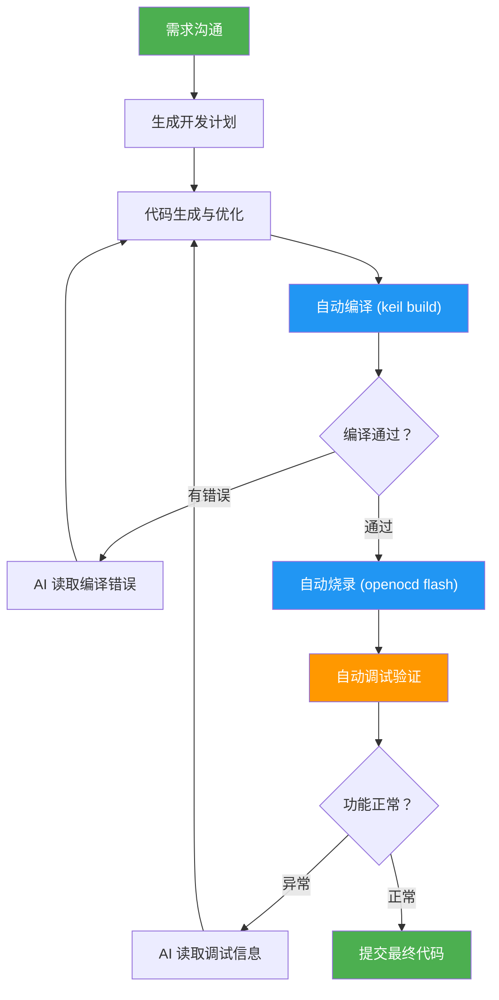
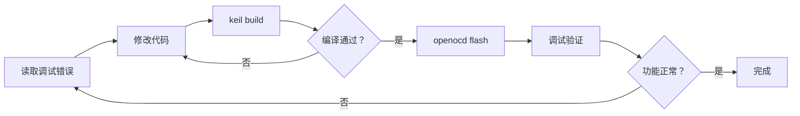

# embeddedskills 使用手册

本手册以 **Keil MDK 工程 + DAP 调试器（OpenOCD）+ Codex** 为例，讲解从安装到闭环开发的完整流程。

---

## 1. 安装 Skill

### 1.1 方式一：npx skills 命令安装（推荐）

借助 [skills](https://skills.sh/) CLI 工具，一条命令即可将 Skill 安装到 AI 工具的技能目录：

```bash
# 安装全部 embeddedskills（自动检测 AI 工具并安装）
npx skills add https://github.com/zhinkgit/embeddedskills -g -y
```


```bash
# 仅安装单个 skill（如只需要 openocd）
npx skills add https://github.com/zhinkgit/embeddedskills --skill openocd -g -y
```

管理已安装的 Skill：

```bash
npx skills ls -g        # 查看已安装列表
npx skills update -g    # 更新到最新版本
npx skills remove -g    # 移除
```


### 1.2 方式二：手动复制到 AI 工具技能目录

若 `npx skills` 不可用，可手动将仓库克隆到对应技能目录：

**Codex：**

```bash
# 全局生效
git clone https://github.com/zhinkgit/embeddedskills.git ~/.codex/skills

# 仅当前项目生效
git clone https://github.com/zhinkgit/embeddedskills.git .codex/skills
```


**Cursor / OpenCode / 其他支持 Skill 协议的 AI 工具：**

请参考对应工具的文档，将 Skill 目录放置到其技能加载路径下。常见路径如下：

| AI 工具 | 技能目录 |
|---------|----------|
| 通用 | `~/.agents/skills/`（全局） |
| Claude Code | `~/.claude/skills/` |
| Cursor | 项目根目录下自定义 |
| OpenCode | 参考其 Skill 协议文档 |
| TRAE | 参考其 Skill 协议文档 |

---

## 2. 验证安装

安装完成后，在 AI 编程助手中输入 `/`，若 Skill 被正确识别，应能看到 OpenOCD、keil 等能力描述：


若未识别到斜杠命令，请检查：
- Skill 目录是否位于正确的技能文件夹路径下
- `SKILL.md` 文件是否完整存在
- AI 工具是否支持 Skill 协议或自定义指令

---

## 3. 配置环境参数

Skill 采用多层配置结构，优先级从高到低为：**CLI 参数 > 环境级配置 > 工程级配置 > 运行状态 > 默认值**。

实际使用时，直接与 AI 对话即可——AI 会根据上下文自动引导你完成环境变量和路径的配置。

---

## 4. 硬件连接与功能测试

### 4.1 硬件连接

使用 CMSIS-DAP 调试器（如 DAPLink）连接开发板。

### 4.2 手动验证编译下载

在让 AI 自主调用 Skill 之前，建议先手动验证工具链是否正常工作。


---

## 5. AI 编程助手集成

### 5.1 自然语言触发

Skill 的 `description` 字段定义了触发关键词，AI 会自动识别上下文并调用对应 Skill，无需手动输入斜杠命令：

| 你的话 | AI 自动触发的 Skill |
|--------|---------------------|
| "帮我编译一下" | `keil` 或 `gcc` |
| "烧录到板子上" | `openocd` 或 `jlink` |
| "看看串口输出" | `serial` |
| "单步调试一下" | `openocd` 或 `jlink` |
| "看看寄存器" | `openocd` 或 `jlink` |
| "一键编译烧录调试" | `workflow` |

只需一句话，AI 即可理解意图并自动完成编译、烧录、调试等操作。

首次使用时，AI 会引导你完成环境配置和工具链验证，之后便可直接用自然语言触发自动化流程。

### 5.2 实际效果演示

AI 自主编译下载：


AI 自主调试：


按照 Skill 设计，AI 完成编译调试后会在项目目录下生成 `embeddedskills` 文件夹，记录每次调用的结果与相关信息，方便后续排查问题。


此后的开发模式变为：**描述需求 → AI 生成代码 → 自动编译下载调试 → 迭代修改，直到功能完成**。

---

## 6. 完整开发工作流

以下是基于 **Keil + DAP(OpenOCD) + Codex** 的完整自动化闭环流程：



### 6.1 错误修复闭环

当调试发现问题时，AI 会自动形成 **读取错误 → 修改代码 → 重新编译 → 重新烧录 → 重新调试** 的闭环：



**典型闭环示例：**

1. AI 发现串口输出乱码
2. AI 读取代码，定位到波特率配置错误
3. AI 修正波特率配置
4. AI 调用 `keil build` 重新编译
5. AI 调用 `openocd flash` 重新烧录
6. AI 调用 `serial monitor` 再次验证
7. 串口输出正常，闭环完成

---

> 本手册持续更新中，如有问题请提交 [GitHub Issues](https://github.com/zhinkgit/embeddedskills/issues)。